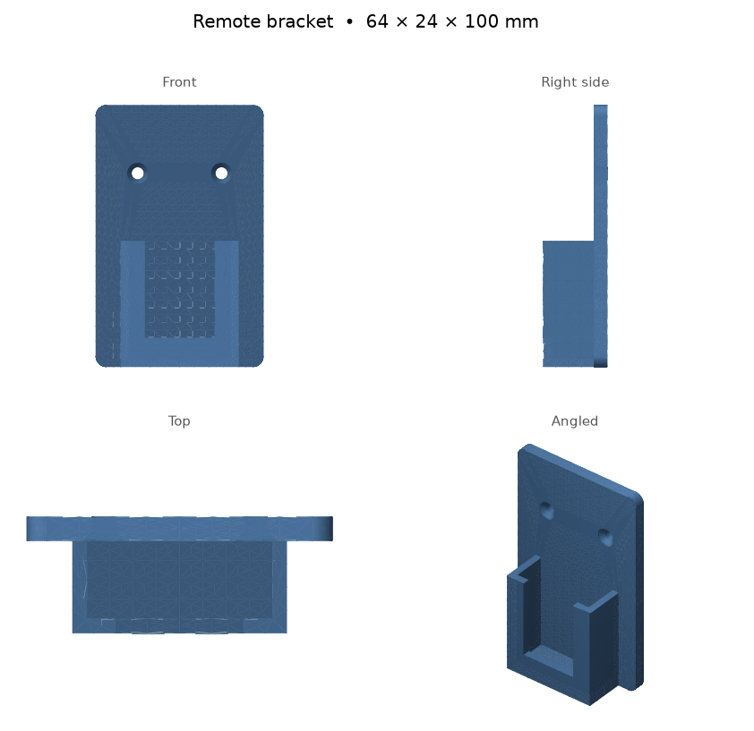
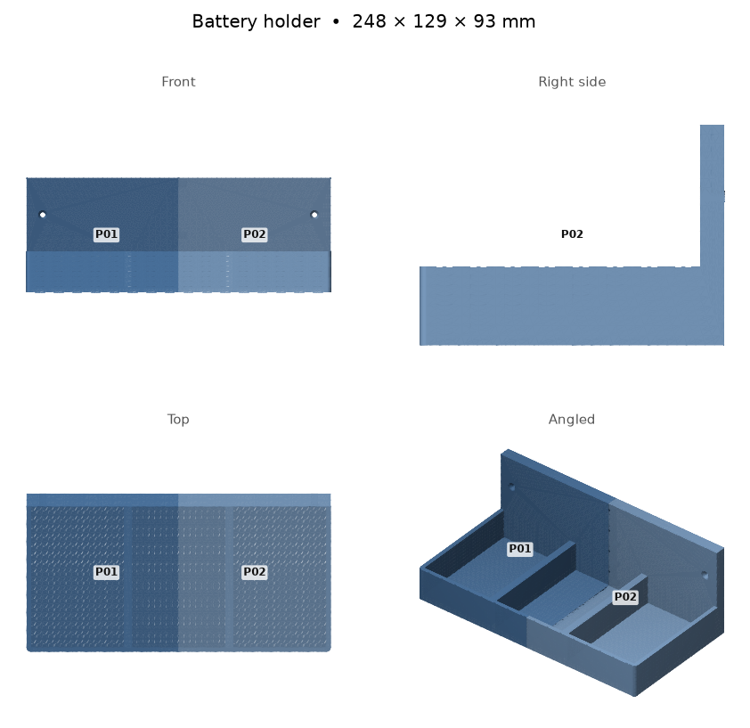
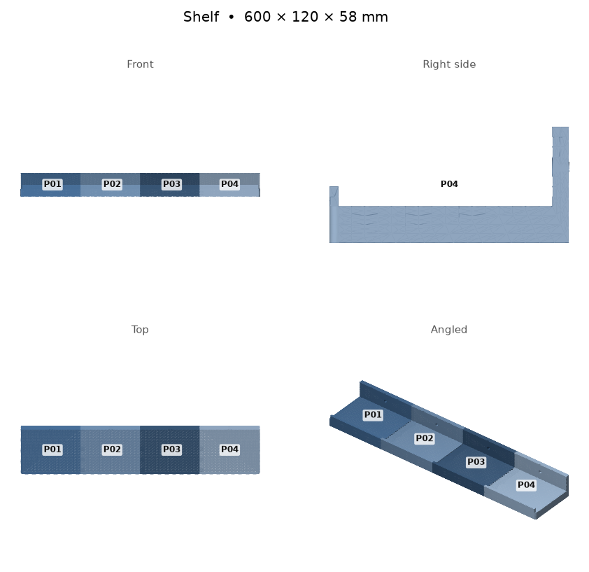
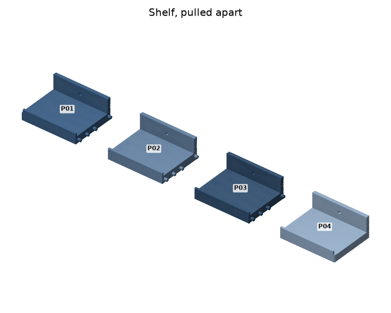
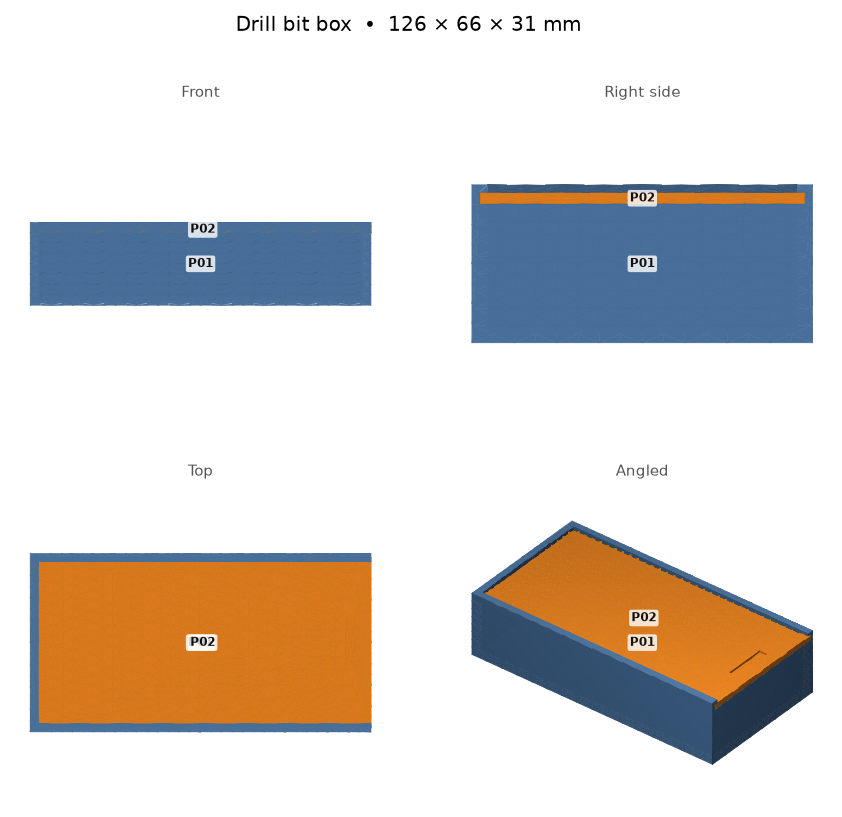

# Examples

Four finished designs. Each one builds with every check passing and needs no supports.
To start your own object from one, ask Claude ("start from the shelf example") or run
`uv run fabricator new "My shelf" -e shelf`. That copies the design into your projects
folder, so changing it never touches these.

Print times and filament were measured by slicing in Bambu Studio for an A1 mini with PLA.

## Remote bracket

A bracket that holds a garage remote by the door, with two screws into the wall.
One piece, about 1 h 06 min and 26 g.

## Battery holder

A wall rack for three tool batteries. It is wider than the printer, so it comes in
2 pieces that peg together. About 4 h 54 min and 222 g.

## Shelf

A 600 mm shelf with a lip at the front. The printer can only do 180 mm, so it comes in
4 pieces joined by pegs. About 9 h 11 min and 507 g.

## Drill-bit box

A box with a lid that slides on along grooves, with 0.20 mm of room on each side so it
slides without rattling. 2 pieces on one plate, about 1 h 21 min and 61 g.

